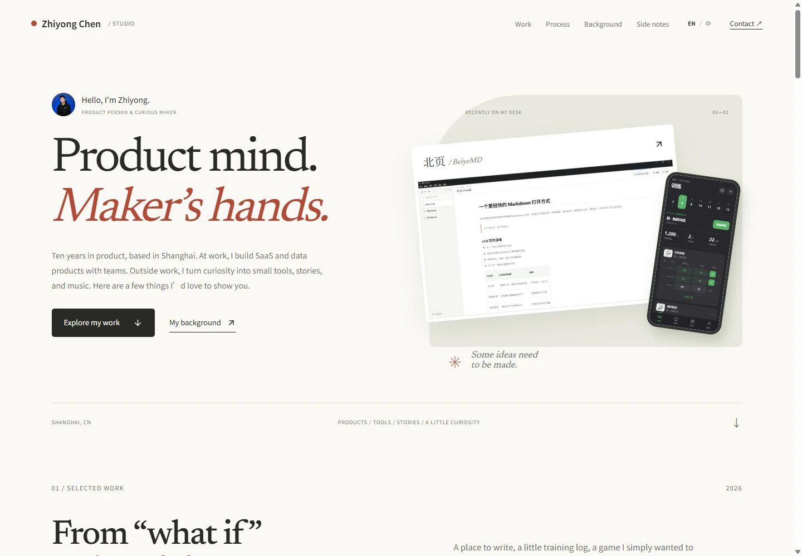
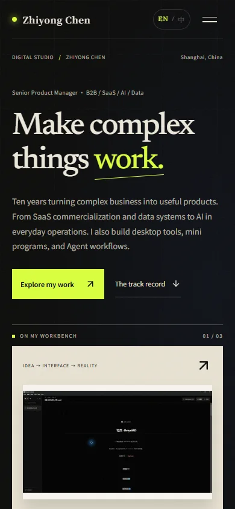

<p align="center">
  
</p>

<h1 align="center">Zhiyong Chen · Digital Studio</h1>

<p align="center">
  一座以证据组织内容、以产品叙事连接职业与创作的个人数字工作室。<br />
  An evidence-led personal studio for product work, AI-assisted building, and creative practice.
</p>

<p align="center">
  <a href="./LICENSE">MIT Code License</a>
  · <a href="./CONTENT-NOTICE.md">Content Notice</a>
  · <a href="./CONTRIBUTING.md">Contributing</a>
</p>

这不是一份把经历塞进卡片里的在线简历。它尝试回答一个更具体的问题：**怎样让访问者在几分钟内看见一个人做过什么、如何判断、怎样把事情做出来，以及哪些结论有真实证据支撑。**

项目将 B2B SaaS / 数据产品经历、个人产品实验、Agent 工作流和长期创作放进同一条叙事路径。页面保留了作者的真实内容，因此它不是开箱即用的匿名模板；但它的内容模型、响应式策略和证据组织方式，可以作为个人主页或作品集的一个扎实起点。

站点支持 English / 中文完整切换：首次访问默认英文，选择中文后仅在浏览器本地保存偏好；页面标题、描述、可见文案、图片替代文本和无障碍标签会同步切换。

## 页面预览

<table>
  <tr>
    <td width="72%" valign="top">
      
    </td>
    <td width="28%" valign="top">
      
    </td>
  </tr>
  <tr>
    <td align="center">1440 × 1000 · 桌面端叙事舞台</td>
    <td align="center">390 × 844 · 移动端重新编排</td>
  </tr>
</table>

## 这个仓库在探索什么

- **Evidence before adjectives**：先给职业结果、项目状态和验证边界，再给定位与总结，不用形容词替代证据。
- **内容与界面分离**：主要文案、项目档案、创作渠道和时间线集中在 `src/data/siteContent.ts`，组件负责讲述，不把事实散落在 JSX 中。
- **完整双语界面**：默认英文、可切换中文；翻译在构建期随源码维护，运行时不依赖外部翻译服务。
- **编辑工作室 × 数字控制室**：墨黑、暖纸色、信号蓝与酸性绿构成视觉系统；不对称编排、克制动效和项目舞台取代通用卡片仪表盘。
- **移动端不是缩小版桌面**：在窄屏中重新安排标题、证据、项目索引和导航节奏，并持续检查横向溢出。
- **可访问的交互**：包含章节定位、移动菜单焦点管理、方向键标签页、项目筛选、工作流展开、复制邮箱反馈，以及 `prefers-reduced-motion` 适配。
- **纯前端、低依赖**：没有分析、追踪、表单、数据库或云服务；内容可以直接审查，构建结果也容易验证。

## 叙事结构

| 章节 | 作用 |
| --- | --- |
| Hero | 用产品主张、职业概览、行动入口与三件可切换的真实作品建立第一印象 |
| 职业基本盘 | 呈现四组履历指标，并用可切换的五个案例展开业务路径与结果 |
| 产品实践 | 以分类筛选、项目索引、图集和页面内档案呈现八个代表项目 |
| 工作系统 | 按需展开内容、AIGC、求职、小说与产品工作的复用机制 |
| 从判断到交付 | 解释问题定义、设计、构建、验证到落地的方法链 |
| 项目图谱 | 保留完整实验路径与真实状态，不把每个原型都包装成产品 |
| 创作矩阵 / 经历 | 连接写作、小说、音乐、视觉实验与职业路径 |

内容可信度、素材来源和未公开边界记录在 [`docs/content-sources.md`](./docs/content-sources.md)。

## 快速开始

需要 Node.js 20.19+ 与 pnpm 10。

```bash
git clone https://github.com/chenzhiyong1994/personal-hub.git
cd personal-hub
pnpm install
pnpm dev
```

打开 `http://127.0.0.1:5173/`。提交改动前运行：

```bash
pnpm run typecheck
pnpm run build
```

## 项目结构

```text
personal-hub/
├─ public/                    # 头像与项目证据图片
├─ src/
│  ├─ components/            # 叙事章节与交互组件
│  ├─ data/siteContent.ts     # 结构化内容的单一事实来源
│  ├─ i18n/                   # 语言状态、人工校正与英文翻译底稿
│  ├─ App.tsx                 # 页面章节编排
│  ├─ styles.css              # 共享视觉系统与章节样式
│  └─ home.css                # 首页编排、交互状态与响应式
├─ docs/
│  ├─ assets/                 # GitHub 介绍图
│  └─ content-sources.md      # 公开事实来源与内容边界
└─ .github/                   # CI 与协作模板
```

## 改造成你自己的 Personal Hub

1. 在 `src/data/siteContent.ts` 替换职业结果、项目、工作系统、创作渠道和时间线。
2. 替换 `public/avatar.jpg` 与 `public/projects/` 中的素材，并为每张内容图片保留准确的 `alt` 文本。
3. 更新 `src/components/Footer.tsx`、`src/components/Navigation.tsx` 中的公开联系方式，以及 `index.html` 的标题和描述。
4. 删除无法公开证明的指标；对原型、内测、已发布和商业使用给出不同状态，不把本地运行等同于真实采用。
5. 发布前检查当前文件和 Git 历史中的邮箱、手机号、本机路径、后台 URL、Token、截图元数据与第三方素材授权。
6. 在 1440 × 1000 和 390 × 844 下完成视觉、键盘和减少动效验证。

> Fork 后请务必替换作者的个人内容和素材。MIT 许可证覆盖软件代码；头像、职业事实、作品文本、项目截图和品牌视觉不在默认复用范围内，详见 [`CONTENT-NOTICE.md`](./CONTENT-NOTICE.md)。

## 技术栈

- React 19 + TypeScript 5.9
- Vite 8
- Motion
- Lucide React
- Fontsource 本地字体

## 内容与 AI 协作原则

作者负责问题定义、产品判断、系统边界、内容真实性和最终验收；AI 参与研究、设计探索、编码与测试。仓库不会把 AI 参与隐藏成“纯手工”，也不会把个人实验包装成商业任职经历。

如果你也在尝试把零散经历整理成一套可信、可读、能持续生长的个人主页，欢迎通过 Issue 分享问题或改进建议。

## 参与贡献

小型修复可以直接提交 Pull Request；涉及视觉方向、内容模型或新增依赖的改动，建议先开 Issue 对齐边界。具体说明见 [`CONTRIBUTING.md`](./CONTRIBUTING.md)。安全或隐私问题请按 [`SECURITY.md`](./SECURITY.md) 私下报告。

## 许可证

软件代码使用 [MIT License](./LICENSE)。个人内容、职业事实、头像、项目截图和仓库品牌视觉不包含在该授权中，见 [`CONTENT-NOTICE.md`](./CONTENT-NOTICE.md)。第三方依赖与字体遵循各自许可证。
